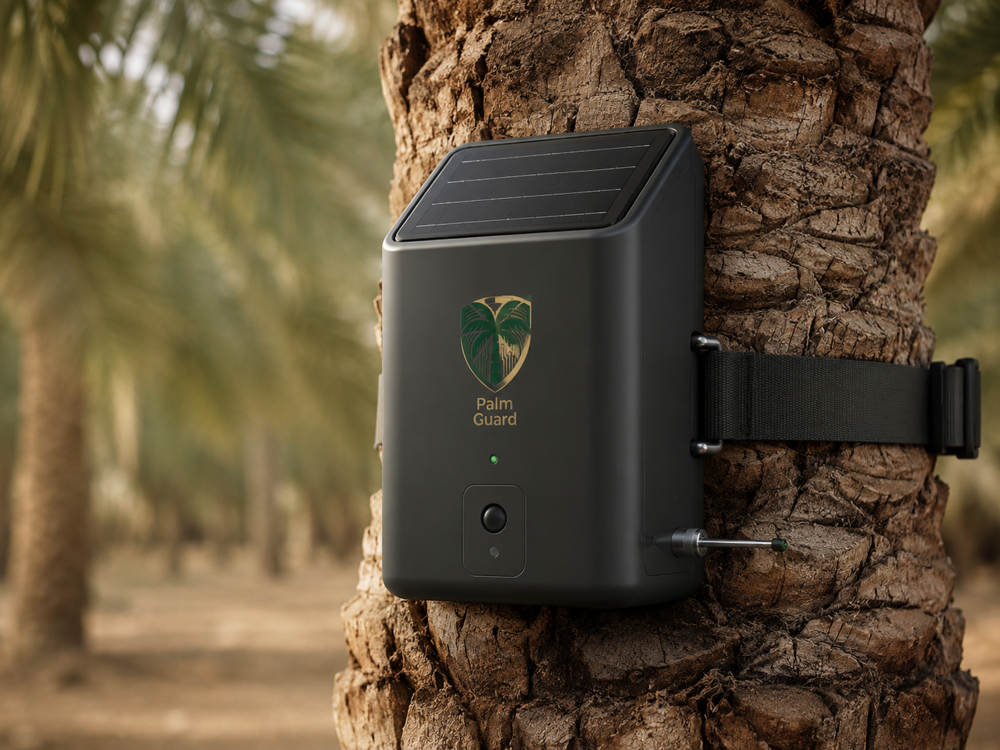
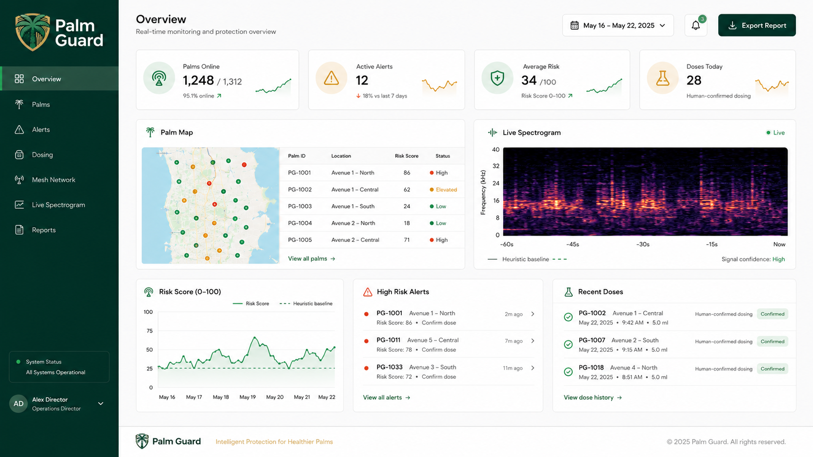
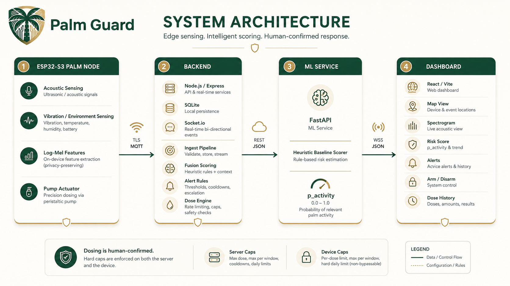
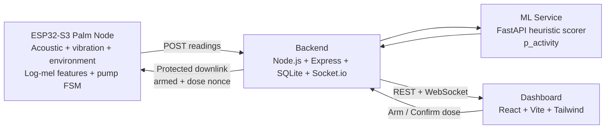
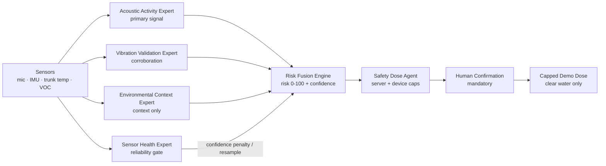

<div align="center">
  

  # Palm Guard

  ### *"Hear the weevil before the palm falls."*
  ### Early RPW acoustic risk detection + human-confirmed micro-dosing  
  #### A self-powered robotic node for precision date-palm protection
  #### WRCC 2026 · Open Category · **Theme 1 — Agriculture**

  <br />

  []()
  []()
  []()
  []()
  [-C2A14D?style=for-the-badge)]()

  <br />

  **Listen early. Treat precisely. Prove every action.**

</div>

---

<p align="center">
  
</p>

## The Product

**Palm Guard** is a solar-powered robotic monitoring node designed to help detect early **Red Palm Weevil** risk in date palms and support a safer, targeted response workflow.

The node mounts directly onto a palm trunk, captures acoustic/vibration activity, sends readings to a backend, and displays live risk evidence on a professional dashboard. When the system identifies a high-risk event, it does **not** blindly dose. Instead, it opens a **human-confirmed micro-dosing workflow** with hard safety limits enforced by both the server and the embedded device.

Built for the **World Robot Caspian Cup — WRCC 2026, Baku**.

---

## Executive Snapshot

<table>
  <tr>
    <td><strong>Problem</strong></td>
    <td>Red Palm Weevil damage is often hidden inside the trunk until visible symptoms appear late.</td>
  </tr>
  <tr>
    <td><strong>Solution</strong></td>
    <td>A per-tree robotic node that listens, scores risk, alerts operators, and supports confirmed micro-dosing.</td>
  </tr>
  <tr>
    <td><strong>Core Hardware</strong></td>
    <td>ESP32-S3, acoustic sensing, vibration/environment inputs, solar power, peristaltic pump actuator.</td>
  </tr>
  <tr>
    <td><strong>Software Stack</strong></td>
    <td>Node.js, Express, SQLite, Socket.io, FastAPI, React, Vite, Tailwind.</td>
  </tr>
  <tr>
    <td><strong>Safety Model</strong></td>
    <td>Human-arm + human-confirm + server caps + device caps + full dose logging.</td>
  </tr>
  <tr>
    <td><strong>Current ML Status</strong></td>
    <td>Heuristic baseline ships by default; a proxy CNN (<code>cnn-aspid-v1</code>) is trained + grouped-CV-evaluated on open ASPID (proxy ROC-AUC ≈ 0.90, PR-AUC 0.926). Proxy only — <strong>not RPW, not field-validated</strong>; artifacts gitignored so a clone serves the heuristic.</td>
  </tr>
</table>

---

## Core Loop

<div align="center">

```text
Sense → Score → Alert → Human Confirm → Micro-dose → Log Evidence
```

</div>

Palm Guard is designed as a full robotic loop, not just an IoT monitor.

| Stage | What Palm Guard Does |
|---|---|
| **Sense** | Captures acoustic/vibration/environment readings from a per-tree node |
| **Score** | Converts readings into activity/risk indicators using a backend scorer |
| **Alert** | Raises high-risk events with context and confidence labels |
| **Confirm** | Requires operator review before any dose command |
| **Act** | Runs a metered pump action through a protected command path |
| **Prove** | Logs detection, command, dose result, and history for accountability |

---

## Dashboard Preview

<p align="center">
  
</p>

The dashboard is built for a live competition demo and future field monitoring:

- farm overview and node health
- palm map and per-tree risk state
- live spectrogram visualization
- active alerts and escalation state
- ARM / DISARM device control
- dose confirmation modal
- dose history and event evidence
- model confidence and proxy-data labels

---

## System Architecture

<p align="center">
  
</p>



---

## Intelligence Layer — Multi-Sensor Expert Architecture

Palm Guard is **not a single black-box detector**. The backend runs a small
**multi-sensor expert architecture** (deterministic "expert" / "signal-model"
modules — no LLM in the control path) that feeds one server-authoritative
**fusion engine**. Acoustic activity is the primary signal; vibration validates
it; environmental sensors add context only; a sensor-health expert protects
reliability; the fusion engine produces a risk score; and a safety agent keeps
dosing human-confirmed, hard-capped, nonce-protected and clear-water-only in
the demo. The dashboard surfaces all of this on the **Intelligence Layer** page.



| Expert / Engine | Role | Honesty boundary |
|---|---|---|
| Acoustic Activity Expert | **Primary** — scores feeding-like acoustic activity | "acoustic activity" / proxy — never "RPW detected" |
| Vibration Validation Expert | Confirms or weakens acoustic suspicion | corroboration only |
| Environmental Context Expert | Trunk-temp + VOC **context** | never claims gas/temp proves infestation |
| Sensor Health Expert | Flags missing/impossible/stale data | forces *resample* on bad data |
| Risk Fusion Engine | Weighted fuse → risk + level + recommendation | mirrors the server-authoritative risk score |
| Safety Dose Agent | Server caps mirror device caps | human-confirmed, nonce, clear-water demo |
| Explanation Agent | Plain-English, judge-friendly rationale | no overclaiming |

**Endpoints / events:** `GET /api/v1/intelligence[/:deviceId]`; Socket.io
`risk:fusion` (fused risk + recommendation + explanation) and `agents:update`
(per-expert breakdown + safety). The existing `live:reading` now also carries an
additive `intelligence` field (backwards-compatible). Full details, payload
examples and the capability-vs-roadmap table: [`docs/INTELLIGENCE_LAYER.md`](docs/INTELLIGENCE_LAYER.md).

> Palm Guard is a solar ESP32-S3 node that listens inside the palm with an
> INMP441 mic, fused with SW-420 analog vibration, DS18B20 trunk temperature and a
> BME680 environmental sensor. The ESP32 runs a 1024-point FFT in firmware to
> build a 40×32 log-mel fingerprint, posts readings to a Node.js + Socket.io
> backend, and a React/Vite mission-control dashboard shows the system live.
> Palm Guard is not a single black-box AI model: acoustic, vibration,
> environmental, and sensor-health experts feed a server-authoritative fusion
> engine. Any treatment path remains human-confirmed, hard-capped,
> nonce-protected, and clear-water only in the demo.

---

## Repository Structure

```text
wrcc/
├── firmware/
│   └── palmguard-esp32s3/
│       ├── ESP32-S3 firmware
│       ├── sensor capture
│       ├── log-mel features
│       ├── Wi-Fi / serial bridge
│       └── pump dose FSM
│
├── backend/
│   ├── Node.js / Express API
│   ├── SQLite database
│   ├── Socket.io live events
│   ├── fusion scoring
│   ├── alert rules
│   └── server-authoritative dose engine
│
├── frontend/
│   ├── public/
│   │   ├── logo.png
│   │   ├── device-render.png
│   │   ├── dashboard-preview.png
│   │   └── system-architecture.png
│   ├── React dashboard
│   ├── Vite
│   ├── Tailwind
│   ├── live spectrogram
│   ├── alerts
│   └── dosing workflow
│
├── ml/
│   ├── FastAPI scorer
│   ├── log-mel feature pipeline
│   ├── heuristic baseline
│   ├── training pipeline
│   └── model card
│
├── tools/
│   ├── mock_device.py
│   ├── seed_palms.py
│   └── serial_bridge.py
│
└── docs/
    ├── BUILD_SPEC.md
    ├── HARDWARE.md
    ├── ARCHITECTURE.md
    └── API.md
```

---

## Honest Robotics Mandate

Palm Guard is built to look premium, but it is also built to stay scientifically honest.

### What Works Today

- backend ingest and live event pipeline
- React/Vite dashboard
- mock device simulation
- dose-pending → confirm → downlink → done workflow
- server-side dosing caps
- device-side dosing caps
- heuristic acoustic activity scoring
- live demo mode without hardware
- clear model-status and proxy-data labelling

### What Is Not Claimed Yet

- no guaranteed real-world larvae detection in all farm conditions
- no large open airborne RPW dataset is claimed
- no trained real-RPW model is claimed yet
- no fully autonomous pesticide treatment
- no field deployment claim yet

The system separates **current verified prototype behavior** from **future field-validation goals**.

---

## Detection Reality

The current prototype uses an **INMP441 airborne MEMS microphone**.

That matters because RPW larvae feed inside the trunk, while an airborne microphone listens through air. Therefore, v1 is most realistic in controlled or low-noise conditions such as:

- quiet close-range tests
- night or low-noise farm environments
- booth/competition demonstrations
- early research trials

Future versions should improve detection with:

- contact microphones
- piezo vibration sensors
- stronger trunk coupling
- mechanical isolation
- real RPW-labelled field recordings
- supervised acoustic model training

---

## Dosing Safety

Palm Guard does **not** dose without human approval.

```text
High-risk event
      ↓
Dose-pending alert
      ↓
Operator reviews dashboard
      ↓
Operator confirms
      ↓
Server sends protected command
      ↓
Device checks cooldown + daily limit
      ↓
Pump runs metered demo dose
      ↓
Result is logged
```

| Safety Layer | Purpose |
|---|---|
| **Human ARM** | Device must be intentionally armed |
| **Human CONFIRM** | Operator approves every dose |
| **Server cooldown** | Prevents repeated dose commands |
| **Server max/day** | Limits total daily dose events |
| **Device cooldown** | Independent embedded protection |
| **Device max/day** | Hardware-side daily cap |
| **Nonce command** | Reduces repeated-command replay risk |
| **Dose history** | Creates traceable evidence |

For WRCC and booth demos, the system should use **clear water or safe demo liquid only**.

---

## Run Without Hardware

Palm Guard can run fully in software using the mock device.

### 1. Start the ML scorer

```bash
cd ml

python -m venv .venv
source .venv/bin/activate

pip install -r requirements.txt
uvicorn serve.app:app --port 8001
```

A fresh clone serves the **heuristic baseline** (the trained proxy CNN
`cnn-aspid-v1` artifacts are gitignored). Neither is a field-validated RPW
model — the proxy number (ROC-AUC ≈ 0.90 on open ASPID) is labelled proxy.

### 2. Start the backend

Requires **Node.js 22+**.

```bash
cd backend

cp .env.example .env
npm install
npm run dev
```

Backend:

```text
http://localhost:4000
```

### 3. Start the dashboard

```bash
cd frontend

npm install
npm run dev
```

Dashboard:

```text
http://localhost:5173
```

### 4. Seed demo palms

```bash
python tools/seed_palms.py --server http://localhost:4000
```

### 5. Run a mock device

```bash
python tools/mock_device.py \
  --device-id PG-001 \
  --server http://localhost:4000
```

---

## Demo the Dose Loop

1. Open the dashboard.
2. Go to **Dosing**.
3. Select device `PG-001`.
4. Click **Arm**.
5. Trigger a forced event:

```bash
python tools/mock_device.py \
  --device-id PG-001 \
  --server http://localhost:4000 \
  --force-event
```

6. A **dose-pending** modal appears.
7. Click **Confirm**.
8. The node receives the downlink command.
9. The mock pump action completes.
10. Dose history shows the result as `done`.

This demonstrates the complete robotic chain:

```text
Sense → Score → Alert → Confirm → Act → Record
```

---

## Firmware

The firmware is built with PlatformIO.

### Main firmware

```bash
cd firmware/palmguard-esp32s3

pio run -e palmguard -t upload
pio device monitor
```

### Wi-Fi firmware

```bash
pio run -e palmguard_wifi -t upload
```

### I2C / 1-Wire scanner

```bash
pio run -e detect -t upload
```

---

## Build Status

| Component | Status |
|---|---|
| Backend API | Working |
| SQLite storage | Working |
| Socket.io live events | Working |
| Dashboard | Working |
| Mock device | Working |
| Dosing workflow | Working in host + mock flow |
| ML scorer | Heuristic baseline live (default) |
| Trained proxy model | `cnn-aspid-v1` — ROC-AUC ≈ 0.90 (proxy, gitignored) |
| Field-validated RPW model | Not yet (next: own INMP441 clips) |
| Firmware code | Written to spec |
| Hardware flashing | Pending |
| Bench test | Pending |
| Field validation | Pending |

See also:

```text
BUILD_LOG.md
docs/BUILD_SPEC.md
docs/HARDWARE.md
ml/README.md
```

---

## Technical Highlights

- ESP32-S3 per-tree robotic node
- solar-powered deployment concept
- acoustic activity monitoring
- log-mel feature extraction
- FastAPI scoring service
- real-time backend events
- SQLite event storage
- React live dashboard
- spectrogram visualization
- server-authoritative dose control
- device-side dose safety caps
- human-confirmed actuation
- complete mock demo without hardware
- clear proxy-data and model-status labelling

---

## Roadmap

### Phase 1 — Competition Prototype

- complete backend
- complete dashboard
- complete mock device
- demonstrate live alerts
- demonstrate human-confirmed dosing
- show dose history and safety caps

### Phase 2 — Hardware Bench Test

- flash ESP32-S3 firmware
- verify microphone capture
- test pump control
- test power behavior
- validate firmware dose caps
- test enclosure mounting

### Phase 3 — Detection Improvement

- collect real trunk recordings
- test contact sensors
- compare airborne vs contact sensing
- build labelled RPW / non-RPW dataset
- train supervised acoustic model
- publish honest validation metrics

### Phase 4 — Field Pilot

- deploy on multiple palms
- monitor solar reliability
- evaluate farm noise
- work with agricultural experts
- validate treatment protocol
- improve model from real-world data

---

## Competition Positioning

Palm Guard fits the WRCC robotics theme because it combines:

- embedded sensing
- signal processing
- live communication
- robotic actuation
- safety interlocks
- operator confirmation
- evidence logging
- a clear path toward field validation

It is a precision-agriculture robotic system built to demonstrate a serious, safe, and scalable response to one of the most damaging palm pests.

---

## Suggested Repository Description

```text
Solar ESP32-S3 palm node for early RPW acoustic risk scoring and human-confirmed micro-dosing.
```

---

<div align="center">

## Palm Guard

### Precision protection for every palm.

**Built by Team VCoders — Abdalrahman AL-Kurdi ([@kurdim12](https://github.com/kurdim12)) · Abdalrahman AL-Haymouni ([@aboodhaymouni](https://github.com/aboodhaymouni)) · Zaid Abu Al-Shaar ([@ZaidAbuAlshaar](https://github.com/ZaidAbuAlshaar)) — IEEE UoP / University of Petra**  
See [`CONTRIBUTORS.md`](CONTRIBUTORS.md).

</div>
