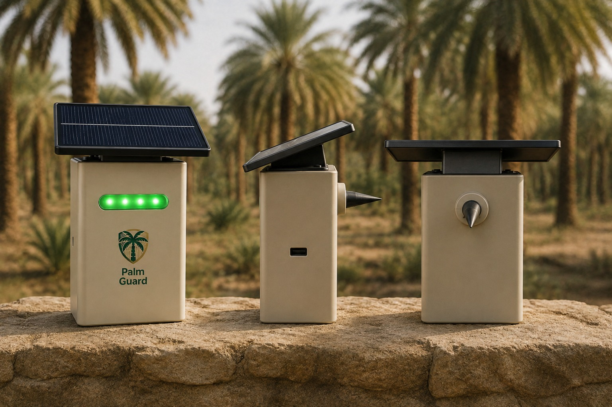
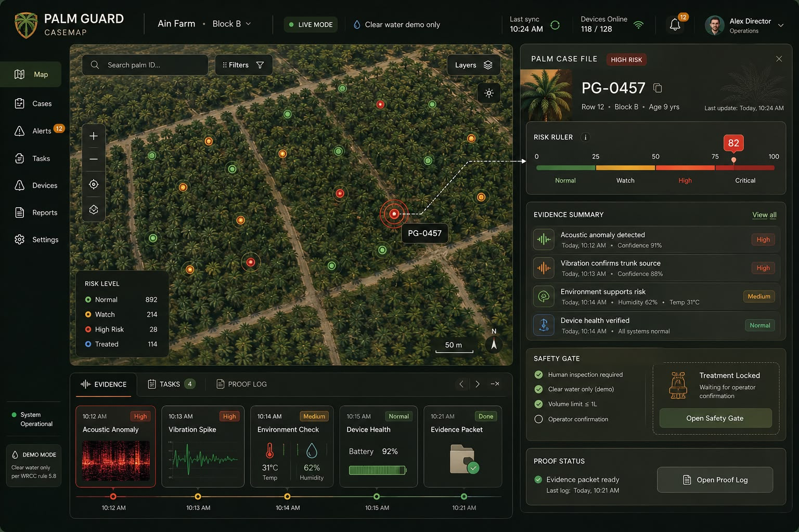

<div align="center">


# Palm Guard

### *Hear the weevil before the palm falls.*

**Solar-powered ESP32-S3 robotic node for early Red Palm Weevil warning, edge-AI risk scoring, and human-confirmed targeted trunk micro-dosing.**

<br />

[]()
[]()
[]()
[]()
[]()
[]()

<br />

### **Listen early. Score locally. Treat precisely. Prove every action.**

</div>

---

<p align="center">
  
</p>

---

## 01 · Project overview

**Palm Guard** is a solar-powered robotic field node that mounts directly on a date-palm trunk to detect early signs of Red Palm Weevil activity before visible damage appears.

The system combines:

* a **physical robotic device** attached to the palm,
* a **multi-sensor edge-AI detection pipeline**,
* a **human-confirmed micro-dosing workflow**,
* and a **live CASEMAP dashboard** for evidence, alerts, and traceability.

Built for the **World Robot Caspian Cup — WRCC 2026, Baku**
Open Category · **Theme 1 — Agriculture**

---

## 02 · The problem

Red Palm Weevil infestation is dangerous because the damage starts **inside** the trunk.

Farmers often cannot see it.

They cannot hear it.

By the time symptoms appear outside the tree, serious damage may already be done.

Palm Guard closes that gap by turning each palm into a monitored case file.

> **The goal is simple: detect risk earlier, confirm it with evidence, and help farmers act before it is too late.**

---

## 03 · System at a glance

| Layer           | What it does                                                               |
| --------------- | -------------------------------------------------------------------------- |
| **Field robot** | Mounts on the palm, reads sensors, scores risk, controls the pump workflow |
| **Edge AI**     | Extracts acoustic features and estimates infestation risk locally          |
| **Backend**     | Stores readings, applies fusion logic, enforces treatment safety rules     |
| **Dashboard**   | Shows live palm status, risk, evidence, alerts, and dose history           |
| **Safety gate** | Prevents blind chemical injection; operator confirmation is required       |

---

# 04 · The device

<div align="center">

## Palm Guard Field Robot

</div>

<p align="center">
  
</p>

The Palm Guard device is the physical robotic node that attaches to the palm trunk.

It is designed to work outdoors, run on solar power, monitor the tree continuously, and communicate risk events to the dashboard.

---

## 04.1 · What the device does

The field robot performs the full local loop:

```text
SENSE → EXTRACT → SCORE → AGREE → ACT → REPORT
```

| Step        | Device action                                            |
| ----------- | -------------------------------------------------------- |
| **Sense**   | Reads acoustic, vibration, and trunk-temperature signals |
| **Extract** | Runs FFT and acoustic feature extraction on the ESP32-S3 |
| **Score**   | Produces a 0–100 risk score                              |
| **Agree**   | Checks whether multiple sensors support the risk signal  |
| **Act**     | Holds treatment behind a safety-gated workflow           |
| **Report**  | Sends the reading and evidence packet to the backend     |

---

## 04.2 · Device hardware

| Component              | Part                             | Purpose                                  |
| ---------------------- | -------------------------------- | ---------------------------------------- |
| **Controller**         | ESP32-S3 DevKitC-1               | Main embedded controller                 |
| **Acoustic sensor**    | INMP441 I²S MEMS microphone      | Primary early-warning signal             |
| **Vibration sensor**   | SW-420 LM393 analog envelope     | Confirms mechanical disturbance          |
| **Temperature sensor** | DS18B20 waterproof 1-Wire        | Adds trunk-temperature context           |
| **Actuator**           | 5 V peristaltic pump             | Demonstrates targeted trunk micro-dosing |
| **Pump driver**        | IRF540 MOSFET                    | Switches the pump safely                 |
| **Status light**       | WS2812 NeoPixel LED              | Shows state, risk, and treatment lock    |
| **Power**              | LiPo + solar charger + regulator | Outdoor autonomous operation             |

---

## 04.3 · Three-sensor detection stack

| Sensor              | Role         | What it helps detect              | Why it matters                            |
| ------------------- | ------------ | --------------------------------- | ----------------------------------------- |
| 🎤 **Acoustic**     | Primary      | Feeding and boring sound patterns | Gives the earliest warning signal         |
| 〰️ **Vibration**    | Confirmation | Mechanical movement in the trunk  | Reduces false positives from random noise |
| 🌡️ **Temperature** | Context      | Local trunk-temperature changes   | Adds biological and environmental context |

Acoustic is the main early-warning layer.

Vibration and temperature make the detection more defensible because the robot does not rely on one microphone alone.

---

## 04.4 · Device safety

Palm Guard separates detection from treatment.

The robot can detect risk automatically, but treatment is not blindly triggered.

A real chemical dose requires:

* operator confirmation,
* backend approval,
* embedded-device approval,
* hard volume limit,
* event logging,
* and dose-history tracking.

For the WRCC booth demo, the pump uses **clear water only**.

---

# 05 · The dashboard

<div align="center">

## CASEMAP Live Dashboard

</div>

<p align="center">
  
</p>

The dashboard is the software command layer for Palm Guard.

It turns every monitored palm into a live case file with risk, evidence, alerts, and treatment history.

The dashboard is not just a display. It is the place where the operator understands the decision and confirms whether action is allowed.

---

## 05.1 · What the dashboard shows

| Dashboard module     | Purpose                                            |
| -------------------- | -------------------------------------------------- |
| **Risk ruler**       | Shows the palm risk score from 0–100               |
| **Palm case file**   | Displays the selected palm and its latest status   |
| **Evidence packet**  | Shows acoustic, vibration, and temperature support |
| **Live spectrogram** | Visualizes acoustic activity                       |
| **Alerts**           | Highlights high-risk events                        |
| **Treatment lock**   | Shows whether dosing is blocked or allowed         |
| **Dose history**     | Logs all actuation events                          |
| **Device health**    | Tracks node status and connectivity                |

---

## 05.2 · Dashboard philosophy

The dashboard is designed around one judging question:

> **Can the team prove why the robot made this decision?**

That is why the UI focuses on evidence, not only numbers.

Instead of showing a simple “infected / not infected” label, the dashboard shows:

* the risk score,
* the sensor evidence behind it,
* whether the system is calibrated or heuristic,
* whether treatment is locked,
* and what action was taken.

---

# 06 · Device vs dashboard

| Field device                  | Dashboard                             |
| ----------------------------- | ------------------------------------- |
| Physical robotic node         | Software monitoring and control layer |
| Mounted on the palm trunk     | Used by farmer / operator / judge     |
| Reads sensors directly        | Displays evidence and live status     |
| Runs local feature extraction | Explains the decision visually        |
| Controls pump workflow        | Confirms or blocks treatment          |
| Works offline-first           | Stores and streams case history       |

The device creates the evidence.

The dashboard explains the evidence.

Together, they form the complete Palm Guard system.

---

# 07 · Full system flow

```text
Palm trunk
   │
   ▼
Palm Guard device
   │
   ├── Acoustic sensor
   ├── Vibration sensor
   └── Temperature sensor
   │
   ▼
ESP32-S3 edge processing
   │
   ├── FFT / acoustic features
   ├── risk scoring
   └── sensor agreement check
   │
   ▼
Backend
   │
   ├── reading storage
   ├── fusion service
   ├── safety rules
   └── dose approval workflow
   │
   ▼
CASEMAP dashboard
   │
   ├── risk ruler
   ├── evidence packet
   ├── live alerts
   ├── treatment lock
   └── dose history
```

---

# 08 · Architecture

```text
ESP32-S3 Field Robot                              Backend + Dashboard
┌──────────────────────────────┐                 ┌──────────────────────────────┐
│ INMP441 acoustic sensor      │                 │ Node.js + Express            │
│ SW-420 vibration sensor      │                 │ Socket.IO live stream        │
│ DS18B20 trunk temperature    │                 │ SQLite event database        │
│                              │                 │                              │
│ FFT + acoustic features      │   HTTPS JSON    │ Fusion service               │
│ Risk score                   │ ─────────────▶  │ ML scoring fallback          │
│ Safety-gated dose FSM        │ ◀─────────────  │ Treatment approval workflow  │
│ Pump + WS2812 status LED     │   dose ACK      │                              │
└──────────────────────────────┘                 └──────────────┬───────────────┘
                                                                 │
                                                                 ▼
                                                       React CASEMAP dashboard
```

---

# 09 · Honesty and validation

Palm Guard is written to be defensible in front of judges.

| Claim                   | Project position                                       |
| ----------------------- | ------------------------------------------------------ |
| **Model validation**    | Proxy-validated, not field-proven                      |
| **Dataset limitation**  | Real RPW field recordings are scarce                   |
| **Default scoring**     | Fresh clones run `heuristic-baseline-v0`               |
| **Calibration**         | Heuristic mode is clearly marked as `calibrated=false` |
| **Treatment**           | Human-confirmed and safety-gated                       |
| **Demo actuation**      | Clear water only                                       |
| **Off-the-shelf parts** | Used intentionally for affordability and repairability |

The model path uses proxy datasets such as ASPID insect acoustics and ESC-50 environmental sound. The current model card reports `cnn-aspid-v1` with proxy ROC-AUC around `0.90`.

Field validation on real RPW-infested palms is the next step.

---

# 10 · Repository structure

```text
wrcc/
├── firmware/palmguard-esp32s3/
│   ├── src/
│   │   ├── main.cpp
│   │   ├── detect.cpp
│   │   ├── sensors/
│   │   ├── actuation/
│   │   └── net/
│   ├── include/config.h
│   └── platformio.ini
│
├── ml/
│   ├── serve/app.py
│   ├── train/
│   ├── features/melspec.py
│   ├── prepare/
│   ├── export/export_tflite.py
│   ├── model_card.md
│   └── requirements.txt
│
├── backend/
│   ├── server.js
│   ├── routes/
│   ├── services/
│   └── scripts/
│
├── frontend/
│   └── src/
│       ├── components/
│       ├── pages/
│       ├── hooks/
│       ├── socket.js
│       └── api.js
│
├── tools/
├── tests/
├── docs/
├── Dockerfile
├── render.yaml
├── railway.json
└── Palm-Guard-Report-FINAL.pdf
```

---

# 11 · Tech stack

| Layer          | Stack                                                           |
| -------------- | --------------------------------------------------------------- |
| **Firmware**   | ESP32-S3 · PlatformIO · C++ · FFT · safety-gated FSM            |
| **Sensors**    | INMP441 · SW-420 · DS18B20                                      |
| **Actuation**  | 5 V peristaltic pump · IRF540 MOSFET · hard dose cap            |
| **ML**         | Python · TensorFlow · TFLite export · FastAPI `/score`          |
| **Backend**    | Node.js 22 · Express · Socket.IO · `node:sqlite` · zod · helmet |
| **Dashboard**  | React 18 · Vite · Tailwind CSS · Recharts · lucide-react        |
| **Deployment** | Docker · Railway · Render · persistent SQLite volume            |

---

# 12 · Quick start

## Prerequisites

* Node.js 22+
* Python 3.10+
* PlatformIO
* ESP32-S3 board

## Run backend and dashboard

```bash
git clone https://github.com/kurdim12/wrcc.git
cd wrcc

npm run install:all
npm run dev
```

Dashboard:

```text
http://localhost:5173
```

Backend API:

```text
http://localhost:3000
```

---

# 13 · Optional services

## Run the ML scoring service

```bash
cd ml
python -m venv .venv
source .venv/bin/activate

pip install -r requirements.txt
uvicorn serve.app:app --port 8001
```

Or from the repository root:

```bash
npm run ml
```

## Feed the dashboard without hardware

```bash
npm run mock
npm run seed
```

## Bridge a real ESP32-S3 over USB serial

```bash
npm run bridge
```

---

# 14 · Firmware flashing

```bash
cd firmware/palmguard-esp32s3

pio run -t upload
pio device monitor
```

Before flashing, update WiFi and backend settings in:

```text
firmware/palmguard-esp32s3/include/config.h
```

This file is the single source of truth for the firmware pin map and network configuration.

---

# 15 · Deployment

Palm Guard deploys as one web service.

The Express backend serves the built React dashboard, streams live data over Socket.IO, and stores readings in SQLite on a persistent disk.

## Railway

Use the included `Dockerfile`.

Recommended environment:

```text
PG_DB_PATH=/data/palmguard.db
```

Add a persistent volume mounted at:

```text
/data
```

Do not set `PORT`; Railway injects it automatically.

## Render

Use the included `render.yaml`.

The blueprint provisions:

* Node.js 22 service,
* built React frontend,
* backend API,
* Socket.IO stream,
* 1 GB persistent disk.

Full deployment steps are in [`DEPLOY.md`](DEPLOY.md).

---

# 16 · Documentation

| Document                                                       | Purpose                                |
| -------------------------------------------------------------- | -------------------------------------- |
| [`docs/ARCHITECTURE.md`](docs/ARCHITECTURE.md)                 | Full system architecture               |
| [`docs/HARDWARE.md`](docs/HARDWARE.md)                         | Wiring, components, power, and sensors |
| [`docs/ESP32_SETUP.md`](docs/ESP32_SETUP.md)                   | ESP32-S3 setup guide                   |
| [`docs/INTELLIGENCE_LAYER.md`](docs/INTELLIGENCE_LAYER.md)     | Fusion and scoring logic               |
| [`docs/DATASET_SELECTION.md`](docs/DATASET_SELECTION.md)       | Dataset choices and limitations        |
| [`docs/MECHANICAL_DOSSIER.md`](docs/MECHANICAL_DOSSIER.md)     | Enclosure and mechanical design        |
| [`docs/DEMO_RUNBOOK.md`](docs/DEMO_RUNBOOK.md)                 | Live booth demonstration plan          |
| [`docs/BOOTH_PLAN.md`](docs/BOOTH_PLAN.md)                     | Booth setup and presentation flow      |
| [`docs/JUDGE_QA.md`](docs/JUDGE_QA.md)                         | Expected judge questions               |
| [`docs/CLAIMS_AUDIT.md`](docs/CLAIMS_AUDIT.md)                 | Claim-by-claim honesty audit           |
| [`docs/API.md`](docs/API.md)                                   | Backend API reference                  |
| [`docs/SUBMISSION_CHECKLIST.md`](docs/SUBMISSION_CHECKLIST.md) | Competition submission checklist       |

Competition report:

[`Palm-Guard-Report-FINAL.pdf`](Palm-Guard-Report-FINAL.pdf)

---

# 17 · Team

<div align="center">

## Vcoders

University of Petra · College of Information Technology · Amman, Jordan

</div>

| Member                                 | Role                | GitHub                                               |
| -------------------------------------- | ------------------- | ---------------------------------------------------- |
| **Abdalrahman Ali Ahmad AL-Kurdi**     | Embedded & AI / CTO | [@kurdim12](https://github.com/kurdim12)             |
| **Abdalrahman Alaa Jihad AL-Haymouni** | Operations / COO    | [@aboodhaymouni](https://github.com/aboodhaymouni)   |
| **Zaid Mahmoud Rajab Abu Al-Shaar**    | Business / CBO      | [@ZaidAbuAlshaar](https://github.com/ZaidAbuAlshaar) |

**Coach:** Dr. Abedal-Kareem Al-Banna
Guidance and logistics

---

# 18 · License

Released under the [MIT License](LICENSE).

---

<div align="center">

<br />

## Palm Guard

### **Listen early. Treat precisely. Prove every action.**

<sub>Vcoders · University of Petra · WRCC 2026 — Baku, Azerbaijan</sub>

</div>
