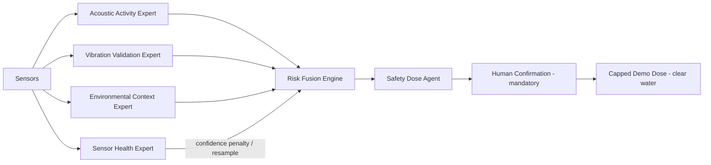

# Intelligence Layer — Multi-Sensor Expert Architecture

Palm Guard does **not** present itself as one black-box AI model. The backend
runs a small **multi-sensor expert architecture**: deterministic "expert" /
"signal-model" modules (no LLM in the real-time control path) whose outputs are
combined by one **server-authoritative fusion engine**. A safety agent keeps any
treatment human-confirmed, hard-capped, nonce-protected, and clear-water-only in
the demo.

> **Design safety:** the expert layer is a *derivation + explanation* layer over
> the already-proven scoring (`services/riskScore.js`) and the safety-tested dose
> path (`services/doseEngine.js`). It does **not** recompute risk or change
> dosing — so the 19 dose-safety tests remain authoritative.

## Architecture



| Module | File | Role |
|---|---|---|
| Acoustic Activity Expert | `backend/services/experts/acousticExpert.js` | **Primary** signal. Scores feeding-like acoustic activity from SA (=100·p_activity) + features. |
| Vibration Validation Expert | `backend/services/experts/vibrationExpert.js` | Confirms or weakens acoustic suspicion (structure-borne 5–25 Hz). |
| Environmental Context Expert | `backend/services/experts/environmentExpert.js` | Trunk-temp + VOC **context only**. |
| Sensor Health Expert | `backend/services/experts/sensorHealthExpert.js` | Missing/impossible/stale detection → confidence penalty / resample. |
| Risk Fusion Engine | `backend/services/engines/riskFusionEngine.js` | risk 0–100, level, confidence, recommendation, breakdown. |
| Safety Dose Agent | `backend/services/engines/doseSafetyEngine.js` | Read-only safety view over `doseEngine` caps. |
| Explanation Agent | `backend/services/experts/explanationExpert.js` | One honest, judge-friendly sentence. |
| Orchestrator + cache | `backend/services/intelligence.js` | Runs all of the above per reading; caches latest per device. |

## Honesty guardrails (enforced in code + copy)
- Acoustic wording is "acoustic activity" / "feeding-like acoustic activity"
  (only at high score) / "proxy" / "risk indicator" — **never "RPW detected"**.
- Environment is **context only** — it never "proves" infestation.
- The ML schema carries `model_family: acoustic_activity_proxy`,
  `validation_status: proxy_validated_not_field_validated`,
  `claim_guardrail: risk_indicator_not_confirmed_rpw_detection`.
- Dosing stays human-armed + human-confirmed, server **and** device capped,
  anti-replay nonce; the demo medium is **clear water only**.

## API & realtime events

`GET /api/v1/intelligence` → latest decision per device.
`GET /api/v1/intelligence/:deviceId` → one device (served from cache; a GET never
mutates baselines).

Socket.io: `risk:fusion`, `agents:update` (new), plus the existing
`live:reading` (now with an additive `intelligence` field), `live:bands`,
`live:alert`, `device:status`, `dose:pending`, `dose:update`, `system:mode`.

### Example `GET /api/v1/intelligence/:deviceId`
```json
{
  "device_id": "PG-DEMO-101",
  "fusion": {
    "risk": 72, "confidence": 0.81, "level": "high",
    "recommendation": "prepare_human_confirmed_dose",
    "reasons": ["risk 72/100 → high", "acoustic 80/100 (primary), vibration 70/100 (confirms)", "..."],
    "expertBreakdown": { "acoustic": {"score":80,"label":"high_acoustic_activity","confidence":0.9}, "...": {} }
  },
  "experts": {
    "acoustic":    { "score": 80, "confidence": 0.9, "label": "high_acoustic_activity", "reasons": ["...", "feeding-like acoustic activity pattern (proxy — not confirmed RPW)"] },
    "vibration":   { "score": 70, "confidence": 0.8, "label": "moderate", "reasons": ["..."] },
    "environment": { "score": 30, "confidence": 0.4, "label": "mild", "reasons": ["environmental signals are context only — they do not confirm infestation"] },
    "sensorHealth":{ "healthy": true, "score": 100, "faults": [], "warnings": [], "confidencePenalty": 0 }
  },
  "safety": {
    "allowed": true, "blockedReason": null, "requiresHumanConfirmation": true,
    "demoClearWaterOnly": true,
    "caps": { "armed": true, "maxDosesDay": 4, "dosesToday": 0, "cooldownS": 1800, "cooldownRemainingS": 0, "pumpMs": 2000, "pumpMsCeiling": 3000, "antiReplayNonce": true }
  },
  "explanation": "Risk is high (72/100, confidence 0.81). Acoustic activity is the primary signal at 80/100; vibration at 70/100 partially confirms it; environmental readings are used only as context. A capped clear-water (demo) dose can be prepared, but it stays armed and requires explicit human confirmation; server and device caps and an anti-replay nonce still apply.",
  "model": { "model_family": "acoustic_activity_proxy", "validation_status": "proxy_validated_not_field_validated", "claim_guardrail": "risk_indicator_not_confirmed_rpw_detection" }
}
```

## Current capability vs roadmap

| Capability | Today | Roadmap |
|---|---|---|
| Multi-sensor expert architecture (backend) | ✅ deterministic, unit-tested | — |
| Fusion risk + confidence + recommendation | ✅ mirrors server risk score | richer confidence calibration |
| Sensor-health gate (resample on bad data) | ✅ missing/impossible/stale | flatline/variance over history |
| Intelligence Layer dashboard page | ✅ hero + experts + flow + safety | per-expert trend history |
| Acoustic model | ⚠️ heuristic/proxy baseline | trained proxy CNN (ASPID + ESC-50), then field validation |
| On-device int8 TFLite | ⏳ export path exists | flash + validate on ESP32-S3 |
| Dosing | ✅ human-confirmed, dual caps, nonce, clear-water demo | field protocol, never autonomous |

## Run it
```bash
# ML scorer (optional — backend falls back to its own heuristic if down)
cd ml && uvicorn serve.app:app --port 8001
# backend (Node 22+)
cd backend && npm install && npm start          # :4000
# dashboard
cd frontend && npm install && npm run dev        # :5173  → open the "Intelligence Layer" page
```
With no device connected, the demo driver populates the experts within seconds.

## Test it
```bash
bash tests/run_all.sh                  # 19 dose-safety tests + expert/fusion unit tests
node --test tests/test_intelligence.mjs # expert/fusion only
cd frontend && npm run build           # dashboard build
```

## Judge spoken paragraph
> Palm Guard is a solar ESP32-S3 node that listens inside the palm with an
> INMP441 mic, fused with MPU6050 vibration, DS18B20 trunk temperature and a
> BME680 environmental sensor. The ESP32 runs a 1024-point FFT in firmware to
> build a 40×32 log-mel fingerprint, posts readings to a Node.js + Socket.io
> backend, and a React/Vite mission-control dashboard shows the system live.
> Palm Guard is not a single black-box AI model: acoustic, vibration,
> environmental, and sensor-health experts feed a server-authoritative fusion
> engine. Any treatment path remains human-confirmed, hard-capped,
> nonce-protected, and clear-water only in the demo.
