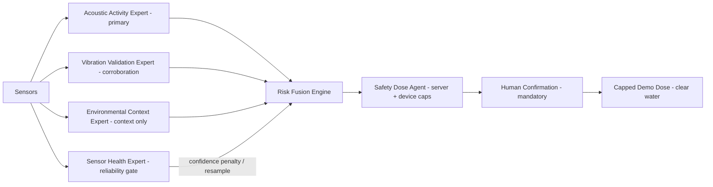

# Palm Guard — Project Report  *(DRAFT)*
### *"Hear the weevil before the palm falls."*
#### Acoustic early-warning + human-confirmed targeted treatment for Red Palm Weevil

**Team:** VCoders  **Members:** Abdalrahman Alaa Jihad AL-Haymouni · Abdalrahman Ali Ahmad AL-Kurdi · Zaid Mahmoud Rajab Abu Al-Shaar
**Country:** Jordan   **Institution/School:** University of Petra — IEEE UoP student branch, Amman, Jordan
**Competition:** World Robot Caspian Cup (WRCC) 2026 · Open Category · **Theme 1 — Agriculture**
**Date:** 22 June 2026   **Repository:** https://github.com/kurdim12/wrcc
**Team photo:** *(insert before final — caption: "Team VCoders — University of Petra")*
<!-- TODO(zaid): insert the team photo asset here, captioned "Team VCoders — University of Petra" -->
<!-- TODO(zaid): vibration sensor standardized on SW-420 (Option B) for consistency with the BOM/firmware; confirm, or switch to a real MPU6050 (Option A) if you add the part + I2C driver. -->
<!-- TODO(zaid): export this report to PDF with Mermaid rendered and CONFIRM <=20 single-sided pages (pandoc undercounts Mermaid — use a Mermaid-capable exporter). -->
<!-- TODO(zaid): fix image paths if your PDF tool needs them relative to repo root (device-render.png, system-architecture.png live at the root, referenced here as ../). -->
<!-- TODO(zaid): in Palm_Guard_BMC_A4.pdf — drop unproven "70%+", make "30-90 days" a target, mark LoRa/Mesh roadmap. -->
<!-- TODO(zaid): confirm References items 3 & 4 exact titles/DOIs (Gutiérrez; Sci. Rep. 2020) before submission. -->
<!-- TODO(zaid): remove these HTML comments + the (DRAFT) marker once the above are done. -->


> **Honesty statement (read first).** Every model number in this report is a
> **proxy** metric or is explicitly marked not-yet-measured. Palm Guard does
> **not** claim validated Red Palm Weevil (RPW) detection accuracy or
> field-proven biological performance. The acoustic model is a proxy/heuristic
> **risk indicator**, not a confirmed-RPW detector. Any treatment path is
> human-confirmed, hard-capped, and uses **clear water only** in the demo.

> **§6.5 conformance (page budget).** This document maps to the mandated report
> structure: **Part 1 Team** (≤1 pp) · **Part 2 Idea Summary** (≤1 pp) ·
> **Part 3 Robotic Solution** (≤12 pp) · **Part 4 Social Impact & Innovation**
> (≤6 pp) · References (not counted). **Total ≤ 20 single-sided pages — over is an
> automatic 0.** When exporting to PDF, hold each part to its budget (trim figures
> first). English, ≤ 15 MB, single-sided.

---

# Part 1 — Team Introduction  *(≤1 page)*

**Team VCoders** is a Jordanian student team (three members + coach) at the
University of Petra (IEEE UoP student branch) building agritech robotics for
date-palm protection. Responsibilities are divided technically (no business-officer
titles) — each member owns a layer of the system end to end:

| Member | Role |
|---|---|
| Abdalrahman Alaa Jihad AL-Haymouni | Hardware & firmware (ESP32-S3, sensors, dose mechanism) |
| Abdalrahman Ali Ahmad AL-Kurdi | Backend, ML pipeline & systems integration |
| Zaid Mahmoud Rajab Abu Al-Shaar | Dashboard, field testing & presentation |

Every member can present and answer technical questions in English. The team
conceived the system, designed the hardware and the multi-sensor architecture,
and made the engineering decisions; AI coding assistants were used as tools (as
with an IDE or compiler) and the team understands and can modify every line.
<!-- TODO(zaid): insert team photo + coach name/eligibility before final. -->

---

# Part 2 — Project Idea Summary  *(≤1 page)*

Red Palm Weevil (*Rhynchophorus ferrugineus*) is a cryptic, internally-feeding
pest of date palms: by the time crown symptoms show, the trunk is often
irreparably damaged, and the usual response — calendar-based, farm-wide pesticide
spraying — is costly, environmentally heavy, and untargeted.

**Palm Guard** is a solar-powered, per-tree **ESP32-S3 robotic node** that
listens *inside* the trunk and fuses four physical signals — acoustic (INMP441
MEMS mic), vibration (SW-420 analog module), trunk temperature (DS18B20) and a
VOC/environment channel (BME680) — into a 0–100 risk score, then **acts** through
a metered micro-dose pump. Sensing and the risk **decision** run autonomously on
the node; the **irreversible chemical action** is deliberately human-confirmed
and hard-capped as a safety/ethics choice. It is implemented end-to-end
(firmware, backend, ML service, dashboard) and demonstrable with zero hardware
via a seeded demo farm. **Slogan: "Hear the weevil before the palm falls."**

---

# Part 3 — Robotic Solution  *(≤12 pages)*

## 3.1 Idea development

The core idea: move from *reactive, farm-wide spraying* to *proactive, per-tree,
targeted response*. Larval feeding produces structure-borne acoustic/vibration
activity detectable in quiet/close conditions. A cheap, solar, duty-cycled node
on each high-value tree can monitor continuously, raise an early risk signal, and
— with a human in the loop — deliver a **targeted** micro-dose to only the tree
that needs it. The robot is therefore not a monitor alone: **detection +
actuation in one self-powered node** is the contribution.

## 3.2 Prior art & differentiation

Acoustic detection of RPW and other wood-/palm-boring larvae is an established
research area — e.g., the long line of acoustic-detection work by Mankin and
colleagues, and commercial/handheld **contact-probe** acoustic detectors
`[FILL: cite Mankin et al.; commercial probe vendor]`. What exists today is
predominantly:

- **Detection-only** (it flags activity; it does not treat), and/or
- **Contact-probe / handheld / operator-driven** (a person walks the orchard with
  a probe), and/or
- **Lab / single-tree** studies rather than deployed, self-powered networks.

**Palm Guard's differentiation:**

| Dimension | Typical prior art | Palm Guard |
|---|---|---|
| Mode | detect-only | **detect → decide → human-confirmed targeted dose** |
| Operation | handheld / operator | **autonomous, continuous, per-tree** |
| Power | mains/handheld | **solar, duty-cycled** |
| Sensing | single (acoustic) | **multi-sensor fusion** (acoustic primary + vibration + thermal + VOC) |
| Honesty | accuracy claims common | **proxy risk indicator, no fabricated accuracy** |
| Safety | n/a (no actuation) | **dual server+device caps, nonce, human-confirm, clear-water demo** |

This is the direct answer to *"isn't acoustic RPW detection already done?"* —
detection exists; **integrated, autonomous, safe, targeted treatment on a
self-powered per-tree node** is what we add.

## 3.3 Mechanical construction & systems engineering


*Figure 1–2: Palm Guard node and end-to-end system — **CAD render / system model**
(WRCC rule 5.1.5 permits a model/prototype; these are renders, not field photos).*

- **Node:** ESP32-S3 DevKitC-1 carrying INMP441 (I²S), an SW-420 analog vibration
  module (ADC; uncalibrated envelope, corroboration only — **not** a calibrated
  accelerometer), DS18B20 (1-Wire), BME680 (I²C), a NeoPixel status LED, and a
  pump driver.
- **Acoustic coupling:** the mic is mounted to couple to the trunk so internal
  feeding sound dominates over airborne noise `[FILL: photo of trunk clamp /
  coupling]`.
- **Dose mechanism:** a small metered pump on a gated driver (`PG_PUMP_GATE_PIN`,
  optional PWM soft-start) delivers a fixed, capped volume; **clear water** in the
  demo `[FILL: pump + reservoir + delivery-line photo]`.
- **Power budget:** solar panel + LiPo + charge controller; the firmware
  duty-cycles (4 Hz cycle, async DS18B20) to fit a per-tree energy budget
  `[FILL: panel/battery sizing + measured current]`.
- **Enclosure:** weather-resistant housing for the node + pump `[FILL: enclosure
  photo / IP rating]`.

*(COTS justification, §5.1.2: off-the-shelf MCU/sensors/pump are used as
components; the **integration** — coupling, dose mechanism, firmware, fusion — is
the team's own design.)*

## 3.4 Detection methodology & multi-sensor expert architecture

1. **On-device features:** 16 kHz audio → hand-written 1024-pt FFT → **40×32
   log-mel** patch (identical filterbank in firmware and `ml/features`,
   `PG_FEATURE_VERSION = logmel-40x32-v1`).
2. **Acoustic activity model:** the scorer returns `p_activity ∈ [0,1]`. A
   reproducible CNN proxy (`cnn-aspid-v1`) is trained + grouped-CV-evaluated on
   ASPID (insect-larvae feeding vs No-Insects): **proxy ROC-AUC 0.905 / PR-AUC
   0.926** (see `model_card.md`). Its artifacts are gitignored, so a fresh clone
   still serves the **transparent heuristic baseline** (`heuristic-baseline-v0`,
   `calibrated=false`). The number is a **proxy** — not RPW, not field-validated.
   No hardcoded "RPW = X kHz" rule; the model owns the spectral call.
3. **Multi-sensor expert architecture (not a black box):**



| Expert / Engine | Role | Honesty boundary |
|---|---|---|
| Acoustic Activity | **primary** — feeding-like acoustic activity | proxy — never "RPW detected" |
| Vibration Validation | confirms/weakens acoustic suspicion | corroboration only |
| Environmental Context | trunk-temp + VOC | **context only** — never "proves" infestation |
| Sensor Health | missing/impossible/stale detection | forces *resample* on bad data |
| Risk Fusion Engine | risk + level + confidence + recommendation | mirrors server risk score |
| Safety Dose Agent | server caps mirror device caps | human-confirmed, nonce, clear-water |
| Explanation Agent | judge-friendly rationale | no overclaiming |

Detail: [`docs/INTELLIGENCE_LAYER.md`](INTELLIGENCE_LAYER.md).

## 3.5 Autonomy architecture (§5.1.1 / §5.1.3)

The robot makes **independent decisions**: each node samples its own sensors,
runs the FFT and acoustic-activity scoring, and decides risk with no operator.

| Stage | Autonomy |
|---|---|
| Sense → feature extraction (on-device) | **Fully autonomous** |
| Acoustic activity + risk decision | **Fully autonomous** (on-device path, below) |
| Alert / escalation | **Fully autonomous** |
| **Irreversible chemical action** | **Human-confirmed by design** (safety/ethics gate, §5.1.4) |

- **On-device decision path** (`src/decision/onboard_decision.h`, flag
  `PG_ONBOARD_AUTONOMY`): the node computes local risk (acoustic primary +
  vibration corroboration) and can **request a dose itself**, with the server
  reduced to monitoring/audit. The dose still passes the device's own failsafes.
- **Honest status:** the decision logic is **host-compiled and unit-tested**; the
  on-hardware build (flag enabled + flashed) is a **bench-validation step** (see
  §3.8 / `docs/BENCH_BRINGUP.md`). Until flashed, the deployed default is
  server-authoritative with the same human-confirm gate.
- A fully hands-off mode (`auto_confirm`) demonstrates the node can close the loop
  alone; we **gate the chemical step by default** as a deliberate ethical choice,
  **not** remote control. "The robot decides; the human authorises the chemical."

## 3.6 Safety engineering

Two independent guards — **server caps** (`doseEngine`) and **device failsafes**
(`dose_fsm`) — must *both* pass before the pump runs:

| Guard | Enforced by |
|---|---|
| Human ARM | server + device |
| Human CONFIRM (per dose) | server (modal) |
| Cooldown / Daily cap | server + device |
| Pump-ms ceiling (≤ 3000 ms) | server + device |
| Anti-replay nonce (single-use) | server issues, device verifies |
| Disarm = hard kill of any open dose | server + physical switch |
| Demo = **clear water only** | policy + UI label |

## 3.7 Programming & validation (honest)

- **29 automated tests pass:** 19 dose-safety (device FSM gauntlet + server caps:
  arm-gating, cooldown, daily cap, pump ceiling, nonce replay, confirm-while-
  disarmed) + 10 expert/fusion unit tests (ranges, environment-never-triggers-
  dose, sensor-health gate, fusion 0–100, high-acoustic+vibration, resample-on-
  bad-health). The on-device decision logic is additionally host-compiled +
  unit-checked. Green CI (safety + expert tests + ML toy-smoke + frontend build).
- **Full loop demonstrated** (detect → fuse → alert → arm → confirm → dose →
  history) via a seeded 16-node demo farm + scripted spike.
- **Measured (proxy only):** grouped 5-fold CV on the open ASPID stored-product-
  insect corpus gives **ROC-AUC 0.905 / PR-AUC 0.926** for larvae-feeding vs clean
  (`silence` condition), reported as a **proxy** in `model_card.md`. **Not
  claimed:** no validated **RPW** accuracy and no **field** metric — these proxy
  numbers are neither RPW nor field-validated, and the trained artifacts are
  gitignored, so a fresh clone serves the labelled heuristic baseline.

## 3.8 Challenges

- **Airborne vs structure-borne sensing:** internal larvae are easiest to hear in
  quiet/close conditions; mitigated by multi-sensor fusion + a sensor-health gate
  that forces *resample* rather than acting on bad data.
- **Safe actuation:** solved with dual server+device caps + nonce + human-confirm.
- **No open real-RPW airborne corpus:** solved by training on **proxy** corpora
  and labelling every metric as proxy (never fabricating accuracy).
- **On-device autonomy without hardware-in-hand:** decision logic written +
  host-validated; flashing/bench validation is the open item.

---

# Part 4 — Social Impact & Innovation  *(≤6 pages)*

## 4.1 Impact & beneficiaries

Date palms are economically and culturally central across the MENA region. RPW is
a quarantine pest present in **60+ countries** (EPPO/FAO A2 list); for the Gulf
region, management/eradication costs were estimated at **~US$5.18 million/year at
1 % infestation, rising to ~US$25.92 million/year at 5 %** [El-Sabea, Faleiro &
Abo-El-Saad, 2009].

**Core innovation — early acoustic warning.** RPW larvae feed **inside** the trunk
for **weeks to months** before external symptoms (crown wilting, bored holes,
frass/oozing) become visible, and young larvae are acoustically detectable from
**~12 days after hatching** with sensitive sensors [Sci. Rep., 2020]. Palm Guard's
acoustic early-warning therefore **targets a 30–90-day lead over visible
symptoms** — a **design target grounded in RPW biology and the acoustic-detection
literature**, not a field-measured result of the current (un-flashed) prototype;
field validation will confirm the exact lead time. Detecting this early is what
makes **targeted, per-tree treatment** possible instead of blanket spraying — a
**projected** reduction in avoidable tree loss and pesticide volume (pending field
validation).

Beneficiaries: **palm-farm owners** (earlier detection → fewer lost trees),
**ministries / plant-protection programs** (targeted instead of blanket spraying),
and **the environment** (less pesticide volume). Treating one tree instead of a
whole block reduces chemical use and cost.

## 4.2 Negative effects, risks & mitigations (honest)

| Risk / negative effect | Mitigation |
|---|---|
| **False positive** → unnecessary dose on a healthy palm | human confirm + clear-water demo + precision-favoring threshold + sensor-health gate |
| **Airborne-mic limits** (noise, distance) → missed/late detection | multi-sensor fusion + honest confidence + *resample*; stated as a limitation, not hidden |
| **Connectivity dependence** | on-device decision path + local failsafes + offline buffering |
| **E-waste / battery footprint** from many nodes | low-power solar + long duty-cycle; design for repair/recycling `[FILL: recycling plan]` |
| **Over-trust / deskilling** | the system *advises*; a human stays in the loop for treatment |
| **Chemical misuse if caps bypassed** | dual server+device caps + nonce + hard disarm |
| **Cost barrier for smallholders** | tiered pricing; government/cooperative programs (see BMC) |

Surfacing these — rather than hiding them — is part of the project's honesty
posture and directly answers the "negative effects" rubric line.

## 4.3 Real-world use example (illustrative)

A 200-tree Medjool farm in the Jordan Valley fits Palm Guard nodes to its
highest-value trees. Over three nights, one node's acoustic-activity score rises
and sustains; the dashboard raises a *watch → elevated* alert with an explanation
("acoustic primary; vibration partially confirms; environment context only").
The operator inspects that tree, and — if warranted — **arms and confirms** a
single targeted treatment on that tree only, instead of spraying the block. The
event, command, and outcome are logged for traceability. *(Illustrative scenario,
not a field result.)*

## 4.4 Business Model Canvas

Nine-block summary; full canvas in `Palm_Guard_BMC_A4.pdf`.

- **Customer segments:** palm-farm owners (small/medium/large); municipalities &
  Ministry of Agriculture; landscaping companies & resorts; Gulf premium date
  farms; agricultural contractors & pest-control firms.
- **Value proposition:** per-tree acoustic + vibration + thermal early-warning
  that **aims** to flag activity before crown symptoms, enabling targeted,
  human-confirmed treatment instead of farm-wide spraying. *(Lead-time and
  loss-reduction are design **targets pending field validation**, not validated
  metrics.)*
- **Channels:** direct field sales; government pilot → national rollout;
  exhibitions; on-farm demos; distributor partnerships (Gulf entry).
- **Customer relationships:** automated alerts + proactive monitoring; Arabic
  farmer support; in-dashboard onboarding; maintenance visits; training workshops.
- **Revenue streams:** hardware (one-time, tiered by farm size) + installation +
  maintenance + data-insight subscription.
- **Key resources:** firmware/backend/expert/ML IP; the node; the team;
  government/farm partnerships; proxy-model datasets.
- **Key activities:** sensor data + edge processing; model training; installation;
  dashboard + alerting; field support.
- **Key partners:** Ministry of Agriculture & plant-protection programs; farms,
  cooperatives & unions; hardware suppliers; AgriTech distributors; universities.
- **Cost structure:** hardware BOM (indicative **~$55–95/node** — to confirm with
  sourcing); cloud/compute; payroll; field ops; connectivity, maintenance & R&D.
  *(Hardware cost estimate only — not a performance claim.)*

> **Connectivity — current vs roadmap:** the node uses **WiFi/HTTP** today (+ a
> serial bridge); **LoRa / Bluetooth-Mesh** on the canvas is **roadmap**, kept
> distinct so the business story matches the codebase.

**Indicative per-node BOM** *(estimate; sourcing TBD — not a performance claim):*

| Component | Qty | Unit (USD) |
|---|---|---|
| ESP32-S3 DevKitC-1 | 1 | 8–12 |
| INMP441 I²S mic | 1 | 2–3 |
| SW-420 vibration module | 1 | 1–3 |
| DS18B20 (waterproof) | 1 | 2 |
| BME680 | 1 | 8–15 |
| Micro peristaltic pump (5 V) | 1 | 8–15 |
| Logic-level MOSFET (IRLZ44N) + passives | 1 | 1–2 |
| Solar 5 V ~1 W + CN3065 + TPS63802 + LiPo | 1 set | 15–25 |
| WS2812 status LED | 1 | 0.5 |
| PCB + enclosure + silicone tubing | 1 | 8–12 |
| **Total** | | **≈ 55–90 / node** |

## 4.5 Datasets & licensing

| Corpus | Role | License |
|---|---|---|
| ASPID / SPIDB | primary proxy (activity vs clean) | MIT (commercial-OK) |
| ESC-50 | noise augmentation only | CC BY-NC (non-commercial — product caveat) |
| InsectSound1000 | **not used** (no clean class) | CC BY 4.0 (resolved at DOI) |

## 4.6 Next steps / prototype development

1. **Flash + bench-validate** the node (incl. `PG_ONBOARD_AUTONOMY`) and capture
   the node acting (clear water) — the critical path to a *real* autonomy claim.
2. **Train the proxy CNN** (ASPID + ESC-50; PCEN/SpecAugment) → report **proxy**
   metrics; pursue on-device int8 TFLite.
3. **Field pilot:** own INMP441 recordings + validation with a research/agriculture
   partner; future contact/AE sensor + LoRa mesh.
4. Transfer-learning (e.g., AudioSet/YAMNet) as a future accuracy boost.

## 4.7 Compliance & ethics

- **Booth medium:** pump uses **clear water only, ≤ 1 L** (§5.8); no pesticide is
  present or applied. This report contains **no pesticide preparation/application
  instructions**.
- **Team-authored solution (§5.3):** firmware, backend, expert layer, ML pipeline
  and dashboard are the team's own code. **There is no LLM in the solution or the
  control path** — an earlier optional dashboard chat helper was removed to keep
  authorship and autonomy unambiguous.
- **Autonomy vs ethics (§5.1.1/§5.1.3/§5.1.4):** the robot senses and decides
  autonomously; the irreversible chemical step is human-gated as a deliberate
  ethical safeguard.

---

## References  *(not counted toward the page limit)*

1. El-Sabea, A.M.M.; Faleiro, J.R.; Abo-El-Saad, M.M. (2009). *The threat of red
   palm weevil Rhynchophorus ferrugineus to date plantations of the Gulf region in
   the Middle-East: an economic perspective.* Outlooks on Pest Management
   20(3):131–134.
2. Mankin, R.W. et al. — acoustic detection of red palm weevil larvae. *Insects*
   (2023). DOI: 10.3390/insects14040339.
3. Gutiérrez, A. et al. — spectral content of RPW boring/feeding (clicks ~0.5–4 kHz,
   feeding energy ~2.25 kHz). `[FILL: confirm full citation]`
4. *Early detection of red palm weevil* (acoustic, ~12-day larval detectability).
   Scientific Reports (2020). `[FILL: confirm full citation/DOI]`
5. ASPID / SPIDB — stored-product-insect acoustic dataset (MIT license) — proxy
   training corpus.
6. Piczak, K.J. (2015). *ESC: Dataset for Environmental Sound Classification.* Proc.
   23rd ACM Int. Conf. on Multimedia. DOI: 10.1145/2733373.2806390. (noise
   augmentation only; CC BY-NC)
7. Branding, J. et al. (2024). *InsectSound1000: an insect sound dataset for deep
   learning based acoustic insect recognition.* Scientific Data. DOI:
   10.1038/s41597-024-03301-4 (dataset DOI 10.5073/20231024-173119-0). *(not used —
   no clean/negative class.)*
8. Osterwalder, A.; Pigneur, Y. (2010). *Business Model Generation.* Wiley.

*(Items 3 and 4 have their basis in `docs/BUILD_SPEC.md`; confirm the exact
title/DOI before final submission — do not fabricate.)*

## Appendix — How to run / test  *(not counted)*
```bash
cd ml && uvicorn serve.app:app --port 8001      # optional; backend falls back if down
cd backend && npm install && npm start           # :4000
cd frontend && npm install && npm run dev         # :5173
bash tests/run_all.sh                             # 29 total: 19 safety + 10 expert/fusion
```
Windows: [`docs/RUN_ON_WINDOWS.md`](RUN_ON_WINDOWS.md) · Demo:
[`docs/DEMO_RUNBOOK.md`](DEMO_RUNBOOK.md) · Judge Q&A: [`docs/JUDGE_QA.md`](JUDGE_QA.md)
· Video: [`docs/VIDEO_SCRIPT.md`](VIDEO_SCRIPT.md).

---
*Prepared for WRCC 2026 by Team VCoders. Honest-by-design: proxy metrics only,
human-confirmed capped dosing, clear water in the demo. **DRAFT — fill title-page
items + photos + citations before submission.***
