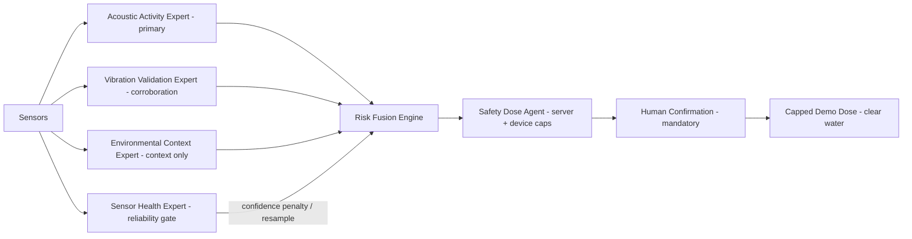
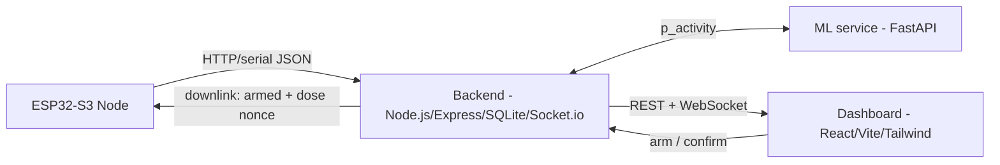

# Palm Guard — Project Report
### Acoustic early-warning + human-confirmed targeted treatment for Red Palm Weevil

**Team:** VCoders
**Members:** Abdalrahman Alaa Jihad AL-Haymouni · Abdalrahman Ali Ahmad AL-Kurdi · Zaid Mahmoud Rajab Abu Al-Shaar
**Country / Institution:** Jordan · `[verify institution]`
**Competition:** World Robot Caspian Cup (WRCC) 2026
**Date:** `[FILL: submission date]`
**Repository:** `[FILL: repo URL]`

> **Honesty statement (read first).** Every model number in this report is a
> **proxy** metric or is explicitly marked as not-yet-measured. Palm Guard does
> **not** claim validated Red Palm Weevil (RPW) detection accuracy or
> field-proven biological performance. The acoustic model is a proxy/heuristic
> **risk indicator**, not a confirmed-RPW detector. Any treatment path is
> human-confirmed, hard-capped, and uses **clear water only** in the demo.

---

## 1. Abstract

Red Palm Weevil (*Rhynchophorus ferrugineus*) is a cryptic, internally-feeding
pest of date palms: by the time crown symptoms are visible, the trunk is often
irreparably damaged, and the common response — calendar-based, farm-wide
pesticide spraying — is costly and blunt. **Palm Guard** is a solar-powered,
per-tree ESP32-S3 node that listens *inside* the palm and fuses four physical
signals — acoustic (INMP441 MEMS mic), vibration (MPU6050 IMU), trunk
temperature (DS18B20) and a VOC/environment channel (BME680) — into a 0–100
risk score. Detection and decision-making are autonomous; the irreversible
chemical action is deliberately **human-confirmed and capped** as a safety and
ethics choice. The system is implemented end-to-end (firmware, backend, ML
service, dashboard) and is demonstrable with zero hardware via a seeded demo
farm. This report describes the architecture, the multi-sensor "expert"
decision pipeline, the safety engineering, what is genuinely validated today
(software: 29 automated tests; a transparent proxy model) and what remains on
the roadmap (on-device flashing, a trained proxy model, and field validation).

## 2. Problem Statement

- RPW is among the most damaging invasive pests of date and ornamental palms
  across the MENA region and beyond, causing severe yield and tree loss
  `[FILL: cite FAO / national plant-protection figure]`.
- Larvae feed **inside the trunk**, so visual inspection detects infestation
  late; recovery is often impossible once the crown wilts.
- The prevailing mitigation — scheduled, farm-wide chemical spraying — is
  expensive, environmentally heavy, and not targeted to actually-infested trees.
- **Opportunity:** larval feeding produces structure-borne acoustic/vibration
  activity that can, in quiet/close conditions, be sensed early — enabling
  *targeted* response instead of blanket spraying.

## 3. Proposed Solution

A network of low-cost, solar, duty-cycled **per-tree nodes**. Each node:
1. captures acoustic + vibration + thermal + VOC signals,
2. extracts an on-device acoustic fingerprint (1024-pt FFT → 40×32 log-mel),
3. posts readings to a server-authoritative backend that fuses the signals into
   a risk score and explains the decision,
4. raises human-readable alerts, and
5. — only after an operator arms **and** confirms — issues a capped, metered,
   nonce-protected dose command (clear water in the demo).

A React mission-control dashboard shows the orchard live: per-tree vitals, a
live acoustic "stethoscope", the multi-sensor decision, and a full safety panel.

## 4. Robotic Solution & Autonomy Architecture

WRCC rewards autonomy (rulebook §5.1.1 "must make independent decisions",
§5.1.3 "operates autonomously, not by remote control"). Palm Guard is designed
to satisfy this **while** treating an irreversible chemical action responsibly,
which the ethics provisions (§5.1.4 and the ethics charter) explicitly reward.

We therefore draw a clear line:

| Stage | Autonomy | Why |
|---|---|---|
| Sense → feature extraction | **Fully autonomous** (on-device) | no human in the loop |
| Multi-sensor fusion → risk → classification | **Fully autonomous** (server) | the robot decides |
| Alert / arm-eligibility | **Fully autonomous** | the robot escalates |
| **Irreversible chemical action** | **Human-confirmed** by design | a false dose pesticides a healthy palm — an ethical, not technical, gate |

The node is **capable** of closing the loop autonomously (an `auto_confirm`
policy exists in code and is exercised in the demo driver), which demonstrates
the autonomy; we **gate the chemical step by default** as a deliberate
safety/ethics decision and surface that choice prominently. This converts an
apparent weakness ("it doesn't spray by itself") into a defensible strength
("it *won't* spray by itself").

### Multi-sensor expert architecture (not a black box)



Detail: [`docs/INTELLIGENCE_LAYER.md`](INTELLIGENCE_LAYER.md).

## 5. System Architecture



- **Hardware:** ESP32-S3 DevKitC-1; INMP441 (I²S), MPU6050 (I²C), DS18B20
  (1-Wire), BME680 (I²C); NeoPixel status LED; metered micro-dose pump; solar +
  LiPo, duty-cycled. (Wiring: [`docs/HARDWARE.md`](HARDWARE.md).)
- **Firmware:** PlatformIO / Arduino (C++), `espressif32@6.7`. Hand-written
  radix-2 **1024-pt FFT** → 16 bins → **40×32 log-mel** patch; parameters fixed
  in `config.h` as the single source of truth (`PG_FEATURE_VERSION
  = logmel-40x32-v1`). Serial-bridge and WiFi/HTTP transports. Device-side dose
  FSM with cooldown, daily cap, pump-ms ceiling, anti-replay nonce.
- **Backend:** Node.js 22+ (built-in `node:sqlite`), Express, Socket.io, Zod,
  Helmet, CORS, node-cron. Server-authoritative risk fusion, dose engine, and
  the multi-sensor expert layer.
- **ML service:** Python 3.11, FastAPI/Uvicorn/NumPy/Pydantic for serving (runs
  the heuristic baseline with no TensorFlow); TensorFlow/Keras + scikit-learn +
  librosa for training/export only.
- **Dashboard:** React 18, Vite 5, Tailwind 3, Socket.io-client, Recharts — a
  "Living Telemetry Interface" with an Intelligence Layer page.

## 6. Detection Methodology

1. **On-device features.** 16 kHz audio → 1024-pt FFT → 40×32 mean-var
   normalized log-mel patch (identical filterbank in firmware and `ml/features`).
2. **Acoustic activity model.** The ML service returns `p_activity ∈ [0,1]`. A
   trained CNN is the target; today a **transparent heuristic baseline** runs
   (`heuristic-baseline-v0`, `calibrated=false`) — a shape detector on the
   feeding band, explicitly **not** a validated classifier.
3. **Multi-sensor fusion.** `SA = 100·p_activity` is fused with vibration (SV),
   thermal (ST) and VOC (SVOC) via adaptive weights (acoustic weighted highest;
   wind/heat/chemical events down-weight the relevant channels) into a 0–100
   risk score.
4. **Expert explanation.** Acoustic (primary) → Vibration (corroboration) →
   Environment (context only) → Sensor-Health (reliability gate) → Fusion →
   recommendation, with a plain-English rationale.

The model owns the spectral decision; there is **no hardcoded "RPW = X kHz"**
rule, and we never display an accuracy figure (see §10).

## 7. Multi-Sensor Expert Architecture

| Expert / Engine | Role | Honesty boundary |
|---|---|---|
| Acoustic Activity | **Primary** signal — feeding-like acoustic activity | proxy — never "RPW detected" |
| Vibration Validation | confirms/weakens acoustic suspicion | corroboration only |
| Environmental Context | trunk-temp + VOC | **context only** — never "proves" infestation |
| Sensor Health | missing/impossible/stale detection | forces *resample* on bad data |
| Risk Fusion Engine | risk + level + confidence + recommendation | mirrors server risk score |
| Safety Dose Agent | server caps mirror device caps | human-confirmed, nonce, clear-water demo |
| Explanation Agent | judge-friendly rationale | no overclaiming |

## 8. Safety Engineering

Two independent guards — **server caps** (`doseEngine`) and **device failsafes**
(`dose_fsm`) — must *both* pass before the pump runs:

| Guard | Enforced by |
|---|---|
| Human ARM (intentional enable) | server + device |
| Human CONFIRM (per dose) | server (modal) |
| Cooldown (min seconds between doses) | server + device |
| Daily cap (rolling 24 h) | server + device |
| Pump-ms ceiling (≤ 3000 ms) | server + device |
| Anti-replay nonce (single-use) | server issues, device verifies |
| Disarm = hard kill of any open dose | server |
| Demo = **clear water only** | policy + UI label |

Nothing doses autonomously. A disarm cancels any in-flight dose. The dashboard's
safety panel shows every guard's live state.

## 9. Validation & Results (honest)

**What is genuinely validated today (software):**
- **29 automated tests pass** — 19 dose-safety tests (device FSM gauntlet +
  server caps: arm-gating, cooldown, daily cap, pump ceiling, nonce replay,
  confirm-while-disarmed) and 10 expert/fusion unit tests (score ranges,
  environment-never-triggers-dose, sensor-health gate, fusion 0–100,
  high-acoustic+vibration, resample-on-bad-health). Notably, the safety tests
  previously caught two real bugs (a cooldown sentinel collision; a nested-
  payload baseline bug).
- **Full detect → fuse → alert → arm → confirm → dose → history loop**
  demonstrated end-to-end via a seeded 16-node demo farm + scripted spike, with
  green CI (safety tests + ML toy-pipeline smoke + frontend build).

**What is NOT claimed:**
- **No validated RPW detection accuracy / no ROC-AUC / no precision-recall** —
  there is no trained, field-validated model yet. `eval_report/` is empty in a
  clone; the serving model is the labelled heuristic baseline.
- No field-proven biological performance.

**Ready-to-run path to real (proxy) numbers:** the training pipeline
(`prepare → features → train → export`) is complete and smoke-tested on toy
data; the dataset plan ([`docs/DATASET_SELECTION.md`](DATASET_SELECTION.md))
targets ASPID + ESC-50 for a **proxy** model whose metrics will be reported as
proxy in `model_card.md`, followed by field validation (§13).

## 10. Datasets & Licensing

| Corpus | Role | License |
|---|---|---|
| ASPID / SPIDB | primary proxy (activity vs clean) | MIT (commercial-OK) |
| ESC-50 | noise augmentation only | CC BY-NC (non-commercial) |
| InsectSound1000 | **not used** (no clean/negative class) | CC BY 4.0 (resolved at DOI) |

Labels are metadata-driven (`aspids_log.csv`); see
[`docs/INTELLIGENCE_LAYER.md`](INTELLIGENCE_LAYER.md) and `ml/model_card.md` for
the honesty fields (`model_family: acoustic_activity_proxy`,
`validation_status: proxy_validated_not_field_validated`).

## 11. Business Model

Nine-block summary; full canvas in `Palm_Guard_BMC_A4.pdf`.

- **Customer segments:** palm-farm owners (small / medium / large);
  municipalities & Ministry of Agriculture; landscaping companies & resorts;
  Gulf-region premium date farms; agricultural contractors & pest-control firms.
- **Value proposition:** per-tree acoustic + vibration + thermal early-warning
  that **aims** to flag feeding-like activity before crown symptoms appear,
  enabling *targeted, human-confirmed* treatment instead of farm-wide spraying —
  reducing avoidable tree loss and chemical use. *(Lead-time and loss-reduction
  figures are design **targets pending field validation**, not validated
  metrics — see §9/§13.)*
- **Channels:** direct field sales; government pilot → national rollout;
  agricultural exhibitions; on-farm demos; distributor partnerships (Gulf entry).
- **Customer relationships:** automated alerts + proactive monitoring; Arabic
  farmer support line; in-dashboard onboarding; annual maintenance visits;
  training / awareness workshops.
- **Revenue streams:** hardware (one-time, tiered by farm size); installation +
  maintenance + data-insight subscription tier. *(Pricing tiers: see BMC —
  indicative.)*
- **Key resources:** the firmware / backend / multi-sensor expert / ML IP; the
  Palm Guard node (ESP32-S3 + sensors); core team (AI / firmware / field
  engineering); seed capital + government/farm partnerships; proxy-model datasets.
- **Key activities:** sensor data collection + edge processing; model training +
  updates; farm installation; dashboard development + real-time alerting;
  maintenance, field support, demos.
- **Key partners:** Ministry of Agriculture & plant-protection programs; palm
  farms, cooperatives & farmer unions; hardware/component suppliers; local
  AgriTech distributors (Jordan + Gulf); universities & research centers.
- **Cost structure:** hardware BOM (indicative **~$55–95/node** — ESP32-S3, mic,
  IMU, temp, VOC, pump+driver, solar+LiPo, enclosure — to confirm with sourcing);
  cloud + compute; engineering payroll; field operations / installation;
  connectivity, maintenance & R&D. *(Hardware cost estimate only — not a
  performance claim.)*

> **Connectivity — current vs roadmap.** The node uses **WiFi/HTTP** today (plus
> a serial bridge for bench use). **LoRa / Bluetooth-Mesh** networking shown on
> the canvas is a **roadmap** item, not yet implemented — kept distinct so the
> business story matches the codebase.

## 12. Compliance & Ethics

- **Booth medium:** the pump uses **clear water only, ≤ 1 L** (rulebook §5.8);
  **no pesticide** is present or applied at the event. This report contains **no
  pesticide preparation/application instructions** by design.
- **Team-authored solution (§5.3):** the firmware, backend, multi-sensor expert
  layer, ML pipeline and dashboard are the team's own code. The optional
  dashboard chat assistant (which may call an external LLM API) is a
  **convenience helper for operators, not the robotic solution itself** and is
  not in the real-time control path.
- **Autonomy vs ethics (§5.1.1/§5.1.3/§5.1.4):** detection and decision are
  autonomous; the irreversible chemical action is human-gated as a deliberate
  ethical safeguard, consistent with the ethics charter's emphasis on the
  robot's impact on people and environment.

## 13. Limitations

- The acoustic model is a **proxy/heuristic** indicator; no field-validated RPW
  accuracy exists yet.
- Airborne MEMS sensing of internal larvae is most reliable in quiet/close/night
  conditions — not an all-weather, farm-wide guarantee.
- Firmware is implemented but **on-device bench validation** for the event is
  pending (see [`docs/BENCH_BRINGUP.md`](BENCH_BRINGUP.md)).
- On-device int8 TFLite inference is a documented stretch goal.

## 14. Roadmap

| Phase | Status | Content |
|---|---|---|
| 1 — Competition prototype | ✅ done | firmware + backend + ML + dashboard + expert layer + demo + 29 tests + CI |
| 2 — Hardware bench test | ⏳ next | flash ESP32-S3, capture a real dosing-with-failsafes demo |
| 3 — Detection improvement | ⏳ | train proxy CNN (ASPID + ESC-50); report **proxy** metrics in `model_card.md` |
| 4 — Field pilot | ⏳ | INMP441 field recordings + validation with a research/agriculture partner |

## 15. References

`[FILL: cite — RPW economic-impact source; ASPID dataset paper; ESC-50 (Piczak 2015); InsectSound1000 (Branding et al. 2024, DOI 10.5073/20231024-173119-0); any acoustic-RPW literature]`

## Appendix A — How to run / test

```bash
# ML scorer (optional; backend falls back to its own heuristic if down)
cd ml && uvicorn serve.app:app --port 8001
# backend (Node 22+) + dashboard
cd backend && npm install && npm start            # :4000
cd frontend && npm install && npm run dev          # :5173
# tests
bash tests/run_all.sh                              # 19 safety + 10 expert/fusion
cd frontend && npm run build
```
Windows: [`docs/RUN_ON_WINDOWS.md`](RUN_ON_WINDOWS.md). Live demo:
[`docs/DEMO_RUNBOOK.md`](DEMO_RUNBOOK.md). Judge Q&A: [`docs/JUDGE_QA.md`](JUDGE_QA.md).

## Appendix B — Repository map
`firmware/palmguard-esp32s3` · `backend` (services/experts, services/engines) ·
`ml` (features, prepare, train, serve) · `frontend` · `tests` · `docs`.

---
*Prepared for WRCC 2026 by Team VCoders. Honest-by-design: proxy metrics only,
human-confirmed capped dosing, clear water in the demo.*
